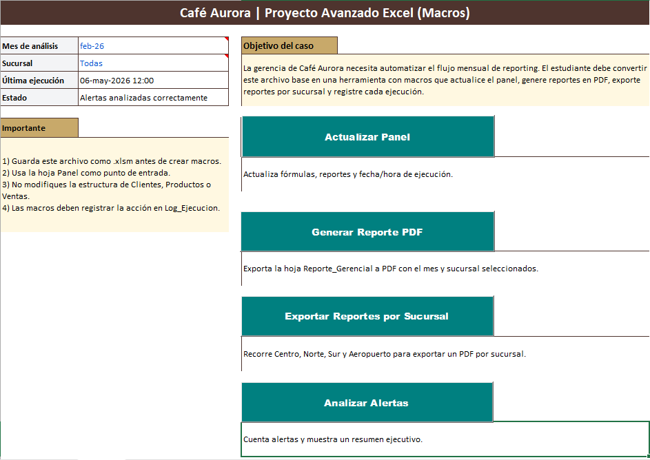
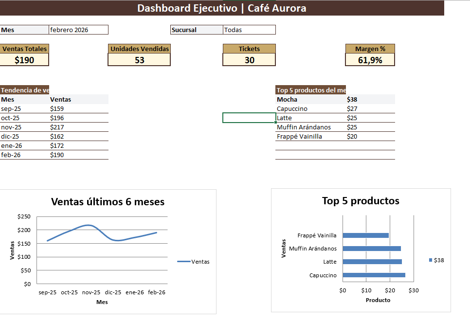
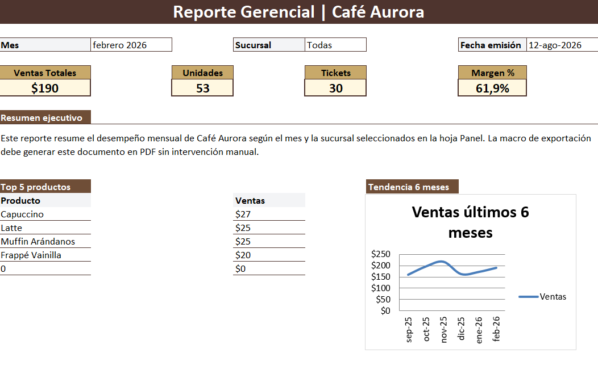

# 📊 Dashboard de Reporting Automatizado | Excel

Solución de reporting desarrollada en **Excel** para Café Aurora, orientada a automatizar el proceso mensual de generación de reportes y facilitar el seguimiento del desempeño del negocio.

El proyecto integra análisis de datos, un dashboard interactivo y automatizaciones mediante **macros en VBA**, reduciendo tareas manuales y agilizando la generación de información para la toma de decisiones.

## ⚙️ Funcionalidades principales

- 📊 Dashboard ejecutivo con indicadores de ventas, unidades vendidas, tickets y margen.
- 📈 Análisis de la evolución de ventas de los últimos 6 meses y ranking de productos.
- 🔄 Actualización automatizada del panel y de los reportes mediante macros en VBA.
- 📄 Generación automática de reportes gerenciales en formato PDF.
- 🏪 Exportación de reportes individuales por sucursal.
- 🚨 Identificación y análisis de alertas para facilitar el seguimiento de indicadores.
- 📝 Registro de las ejecuciones realizadas mediante un log de control.

## 🛠️ Herramientas utilizadas

- **Microsoft Excel** — análisis, organización y visualización de datos.
- **VBA (Visual Basic for Applications)** — desarrollo de macros para automatizar procesos.
- **Macros de Excel** — actualización del panel, generación de reportes, exportación de archivos y registro de ejecuciones.

  ## 🖼️ Vista del proyecto

### Panel de automatización
Desde este panel se centralizan las principales acciones automatizadas del proyecto, como la actualización de información, generación de reportes y análisis de alertas.

### Dashboard ejecutivo
Visualización de los principales indicadores del negocio, incluyendo ventas, unidades, tickets, margen, evolución temporal y ranking de productos.

### Reporte gerencial
Reporte consolidado generado para facilitar el seguimiento mensual de los principales indicadores y resultados por sucursal.

## 📁 Estructura del proyecto

El archivo está organizado en diferentes hojas que cumplen funciones específicas dentro del proceso de análisis y reporting:

- **Panel:** interfaz principal desde la cual se ejecutan las automatizaciones.
- **Clientes:** información correspondiente a los clientes.
- **Productos:** información y características de los productos.
- **Ventas:** registro de las operaciones utilizadas como base para el análisis.
- **Dashboard:** visualización interactiva de los principales indicadores del negocio.
- **Alertas:** identificación y seguimiento de situaciones que requieren atención.
- **Reporte_Gerencial:** consolidación de indicadores para el seguimiento de resultados.
- **Log_Ejecucion:** registro de las ejecuciones realizadas por las automatizaciones.

## ▶️ Cómo utilizar el proyecto

1. Descargar el archivo `.xlsm` disponible en este repositorio.
2. Abrirlo con **Microsoft Excel**.
3. Habilitar la ejecución de macros cuando Excel lo solicite.
4. Utilizar la hoja **Panel** como punto de acceso a las principales automatizaciones.
5. Explorar el **Dashboard** y el **Reporte_Gerencial** para analizar los resultados.

> ⚠️ **Nota:** el archivo utiliza macros desarrolladas en VBA, por lo que algunas funcionalidades requieren Microsoft Excel con la ejecución de macros habilitada.
